# Assets
Dies ist eine Liste mit den benötigten oder schon gefundenen Assets.

## Spiel
### Soldaten-Figuren mit TSK spezifischem Aussehen.

  
Luftwaffe

  
- Model ([Credit](./Assets/figure_model_credit.txt))  
  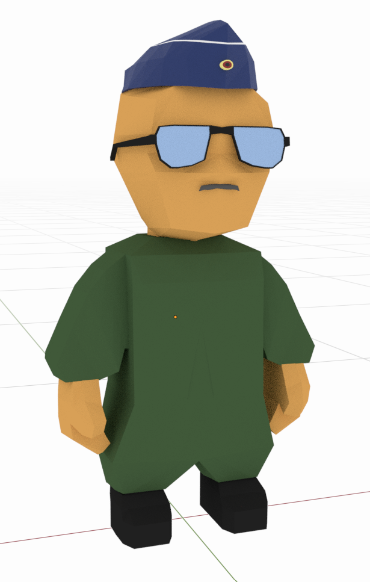

  
Heer

  
- Model ([Credit](./Assets/figure_model_credit.txt))  
  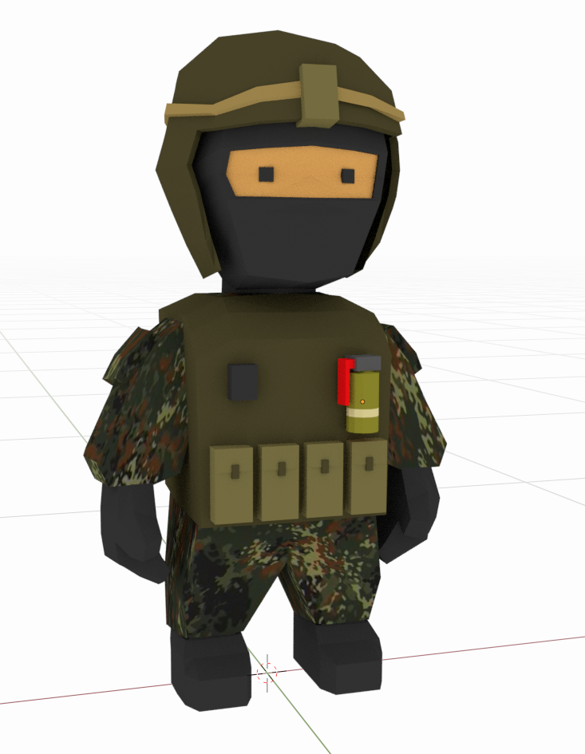

  
Marine

  
- Model ([Credit](./Assets/figure_model_credit.txt))  
  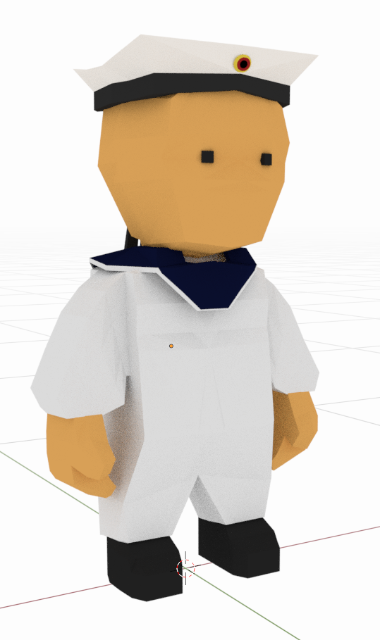

  
CIR

  
- Model ([Credit](./Assets/figure_model_credit.txt))  
  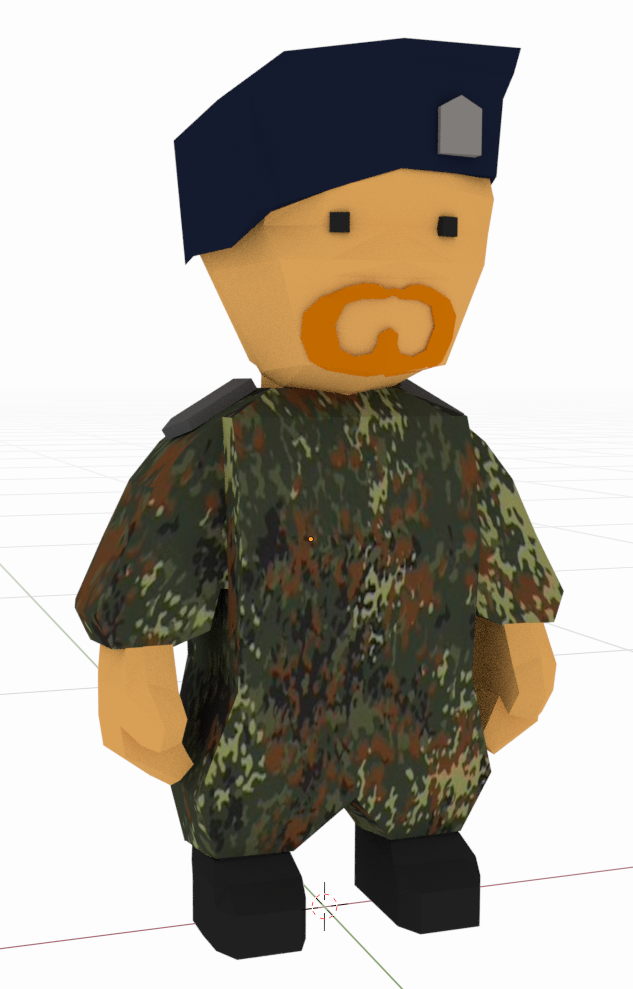

### Ein Würfel mit den Zahlen 1-6.

    
Würfel

- [Model](./Assets/dice/dice.zip)
- [Credit](./Assets/dice/dice_credit.txt)
- 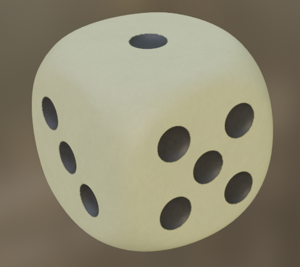

### Das MDGA Spielbrett.

    
Map

- 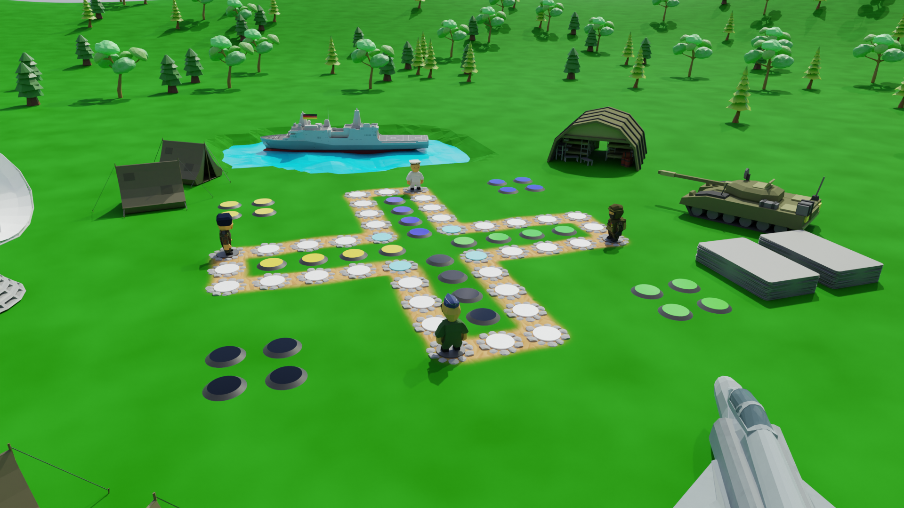
- 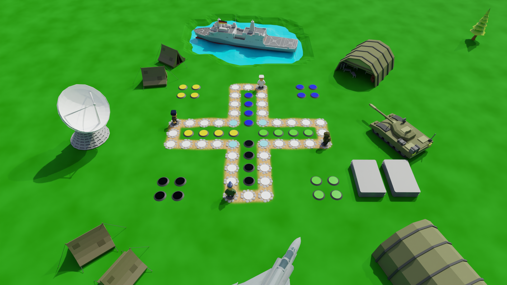
 - 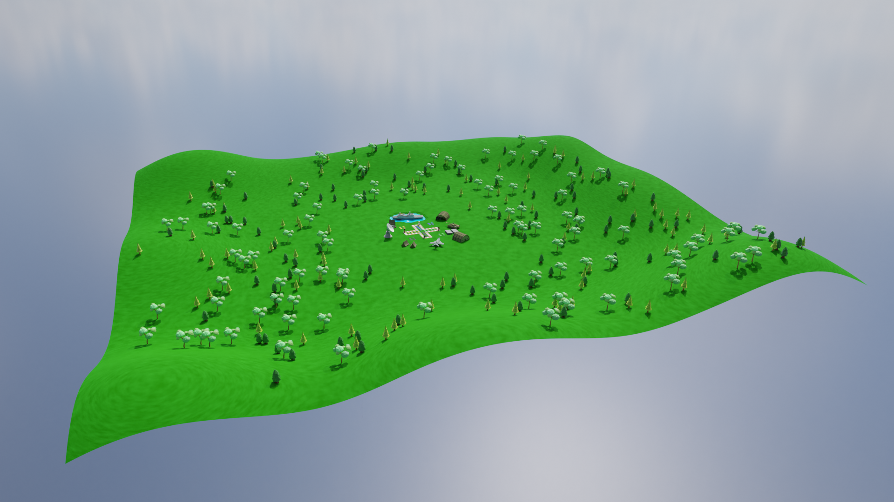

### Die Bonuskarten.

    
Bonuskarten

- 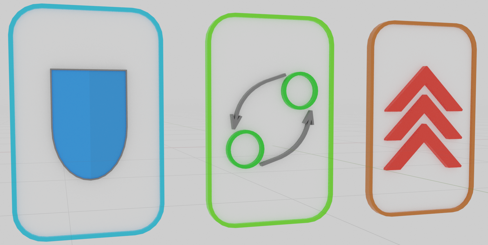

### Die Skybox für die Map

    
Skybox

- [Credit](./Assets/skybox/skybox_credit.txt)
- 

## Dekoration

    
Panzer

- [Model](./Assets/tank/Tank.fbx)
- [Credit](./Assets/tank/tank_credit.txt)
- 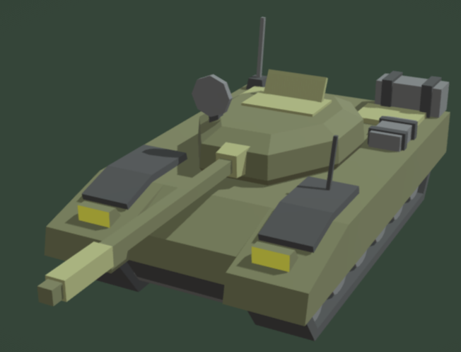

    
Jet

- [Model](./Assets/jet/jet.zip)
- [Credit](./Assets/jet/jet_credit.txt)
- 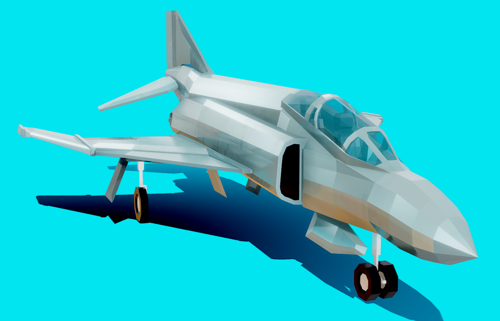

    
Zelte

- [Tent 1 Model](./Assets/tent/tent1.fbx)
- [Tent 1 Credit](./Assets/tent/tent1_credit.txt)
- Tent 1 Screenshot:
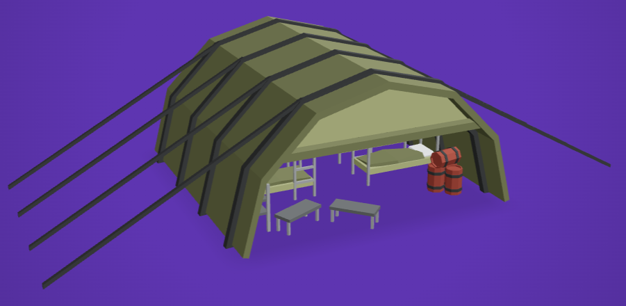
- [Tent 2 Model](./Assets/tent/tent2.fbx)
- [Tent 2 Credit](./Assets/tent/tent2_credit.txt)
- Tent 2 Screenshot:
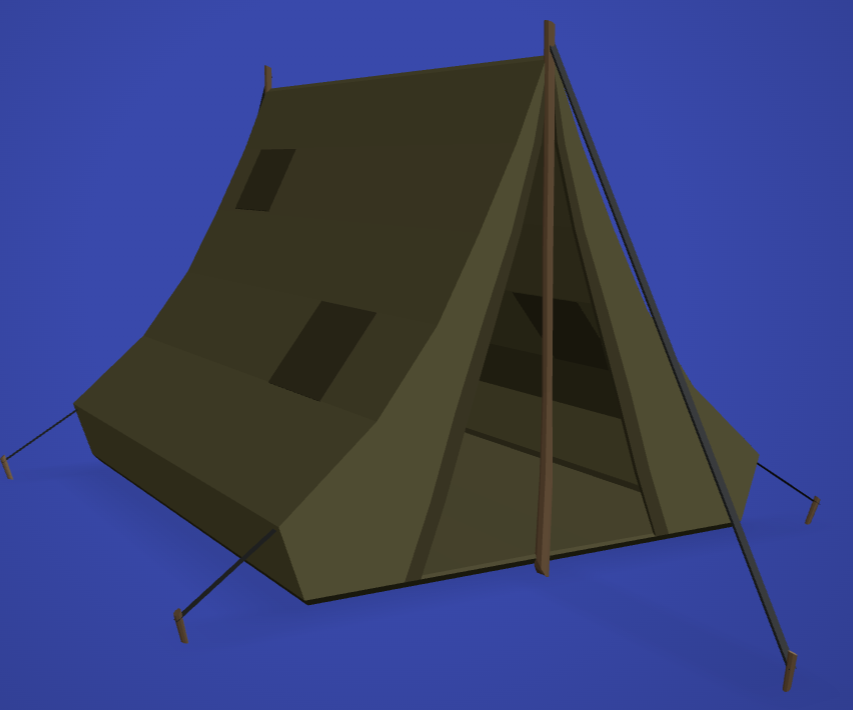

    
Schiff

- [Model](./Assets/ship/ship.zip)
- [Credit](./Assets/ship/ship_credit.txt)
- 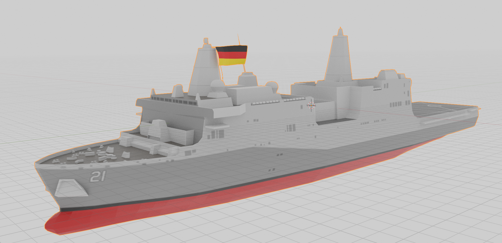

    
Bäume

- [Tree 1 Model](./Assets/Trees/tree1.zip)
- [Tree 1 Credit](./Assets/Trees/tree1_credit.txt)
- Tree 1 Screenshot:
  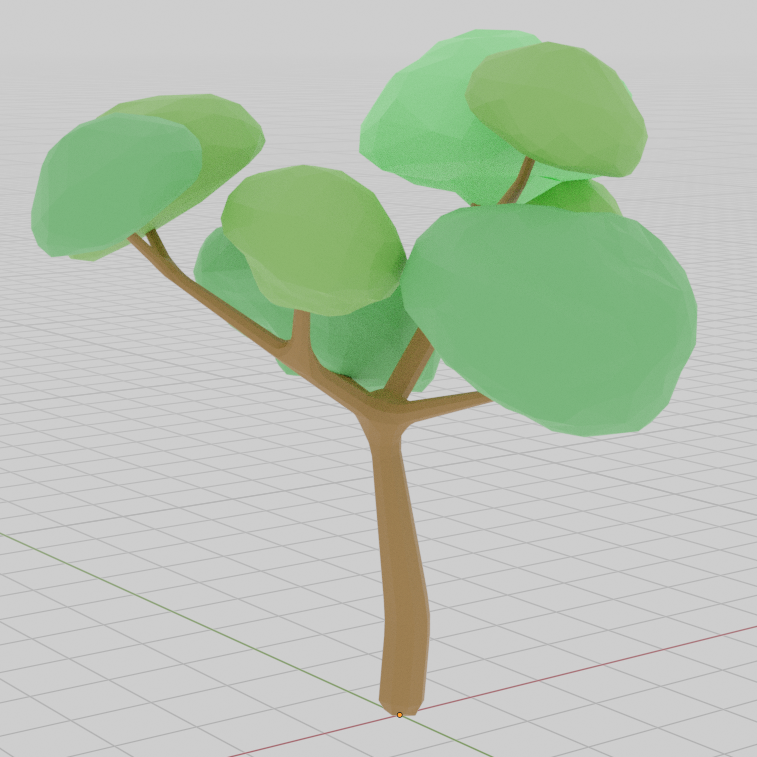
- [Tree 2 Model](./Assets/Trees/tree2.zip)
- [Tree 2 Credit](./Assets/Trees/tree2_credit.txt)
- Tree 2 Screenshot:
  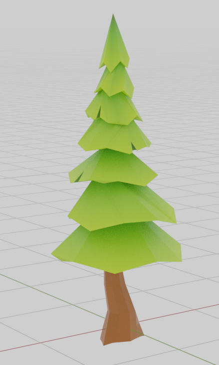
- [Tree 3 Model](./Assets/Trees/tree3.blend)
- [Tree 3 Credit](./Assets/Trees/tree3_credit.txt)
- Tree 3 Screenshot:
  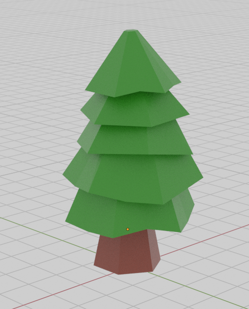

    
Radar

- [Radar Model](./Assets/radar/RADAR.blend)
- [Radar Credit](./Assets/radar/radar_credit.txt)
- Radar Screenshot:
  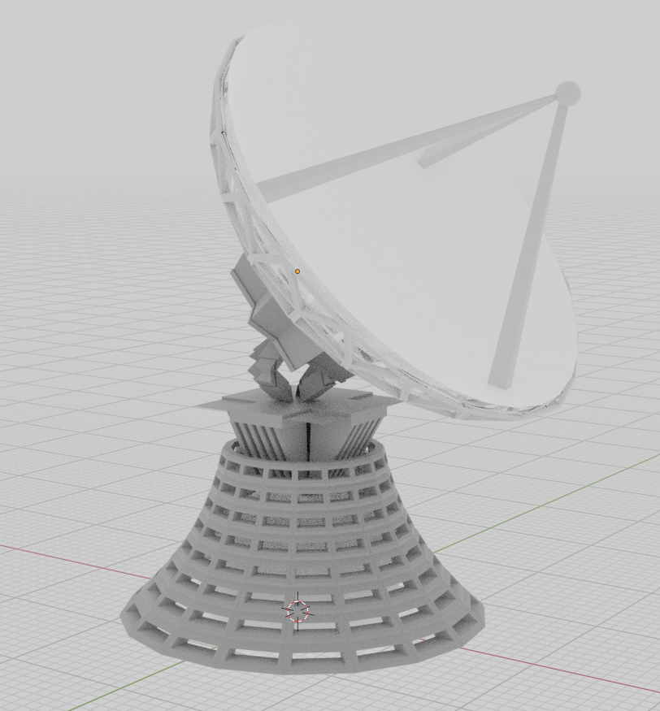

## Musik
- Hintergrundmusik

## Sounds
- dice_roll

- turn_start
- turn_end

- piece_move
- piece_lost

- select
- deselect

## Grid System (Ist kein Assest)
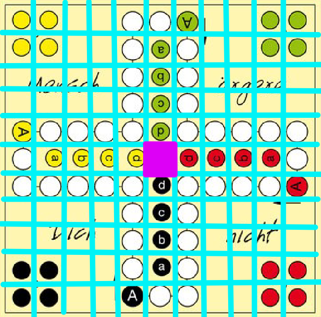