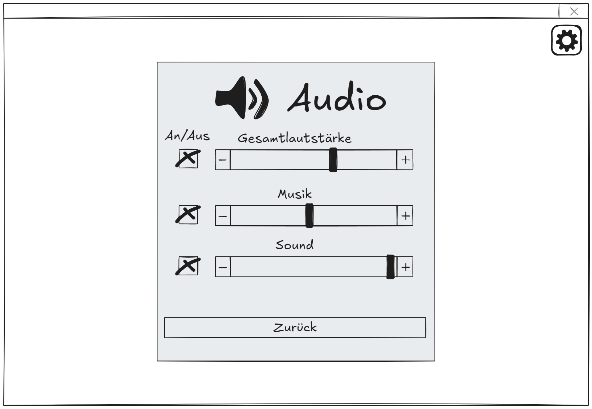

# Informationen zu dieser Seite

Auf dieser Seite sind die GUI-Skizzen der Analysephase zu finden.

---

# Artefakte

GUI-Skizzen v.01

- Start-Dialog

- Einstellungs-Dialog
  

- Video-Einstellungen-Dialog
  

- Audio-Einstellungen-Dialog
  

- Lobby-Dialog vom Host
  

- Lobby-Dialog vom Client
  

- Netzwerk-Dialog
  

- Normale Ansicht der Kamera
  

- Strategische Ansicht der Kamera
  

- Spielauszeit nach Verbindungsverlust
  

- Spielinformationen
  

- Platzierung
  

- Statistiken zum Spiel
  

- Powerkarten
  

- Award Ceremony
  

GUI-Skizzen v.02

- Award Ceremony
  

- Verbindungs Fehler
  

