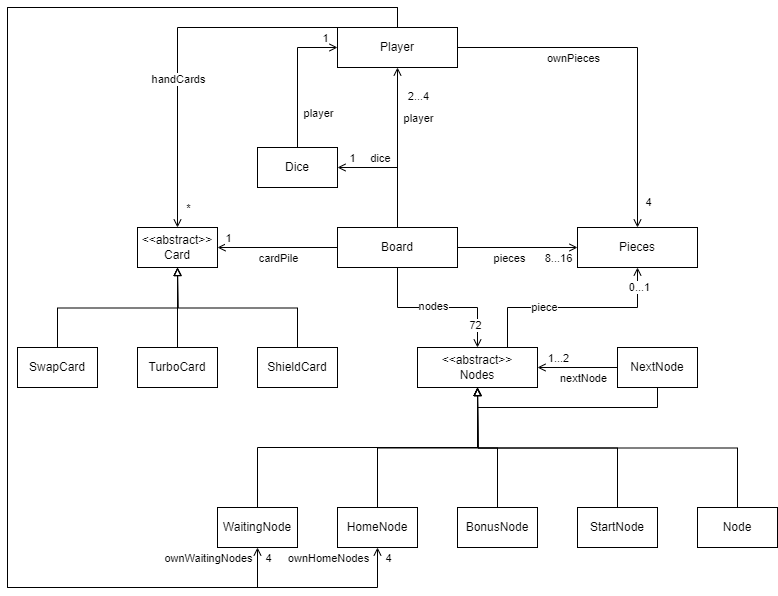
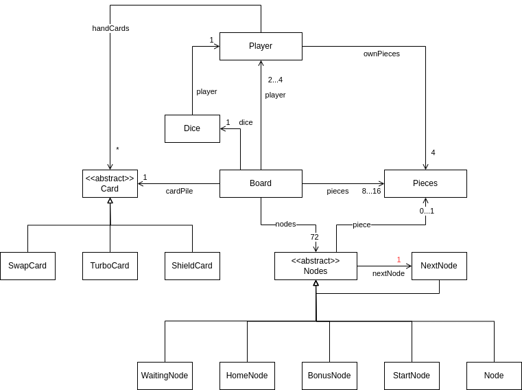

# Informationen zu dieser Seite

Auf dieser Seite werden die Klassendiagramme der Analysephase dargestellt.

---

# Artefakte

Klassendiagramme v.01

- v0.1
  

Klassendiagramme v.02

### Änderungen zu version 0.1
- Entfernung der Bezüge von Player auf seine eigenen spezifischen Felder, da diese dann über das Board gehandhabt werden.
- Änderung des Bezuges zwischen Nodes and NextNode, um das CompositeModel zu repräsentieren. Ebenso wurde eine Änderung an der Anzahl an bekannten NextNodes von 1..2 auf nur 1 geändert, da die Möglichkeit des Abbiegens ins Haus durch Logik im Board gehandhabt wird.

- v0.2

