# Informationen zu dieser Seite 

Auf dieser Seite findet man die Zustandsdiagramme das Spiel.

# Artefakte

Zustandsdiagramme v0.1

- Client-Zustandsdiagramm
  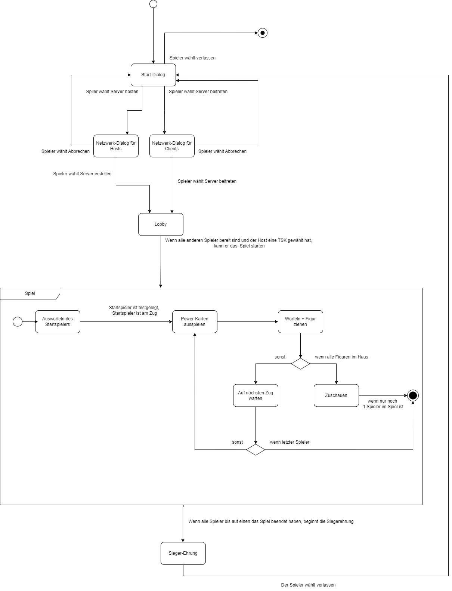

Zustandsdiagramme v0.2

- [Erläuterung Diagramme](./Diagramme/Zustandsdiagramme/Week-2/DrawIO/Erläuterungen_Zustandsdiagram_Client_v0.1.pdf)

- 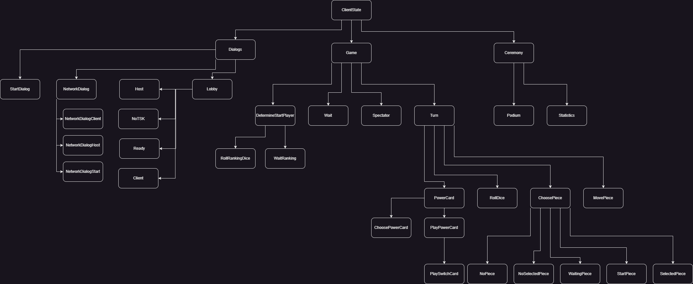
   
**ClientState**
- 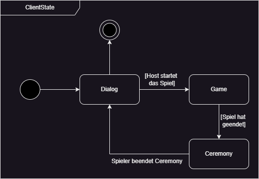

  
Dialogs

  - 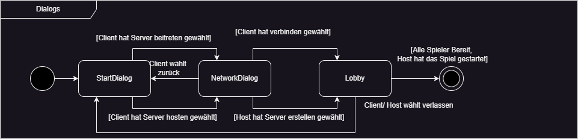

  - 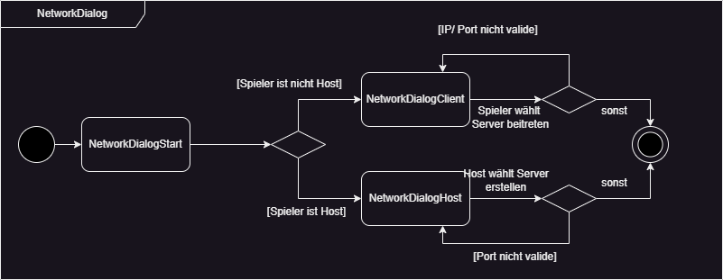
  - 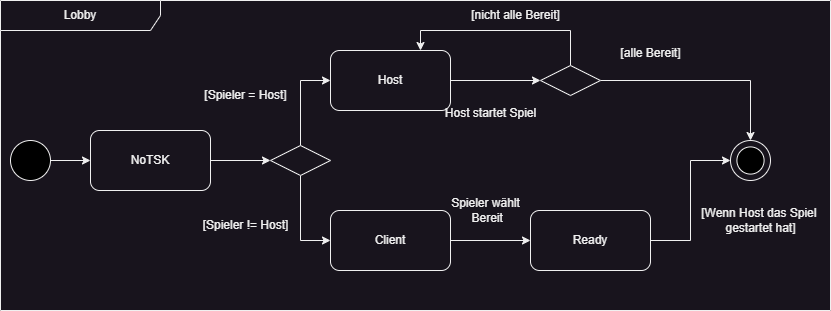

  
Game

  - 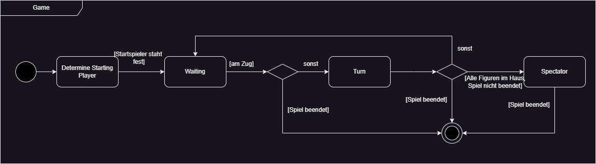

    - 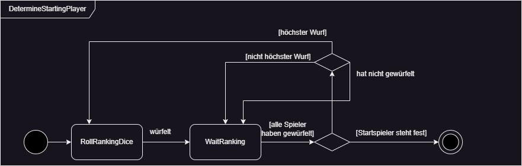

    

    
Turn

      - 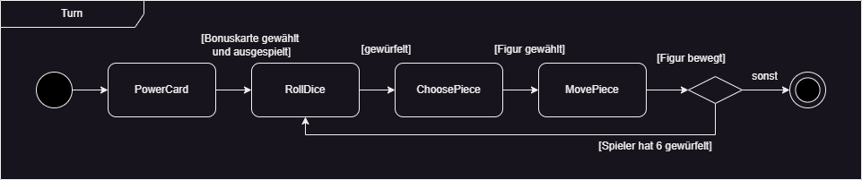

      

      
PowerCard

    
      - 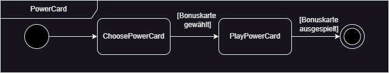

      - 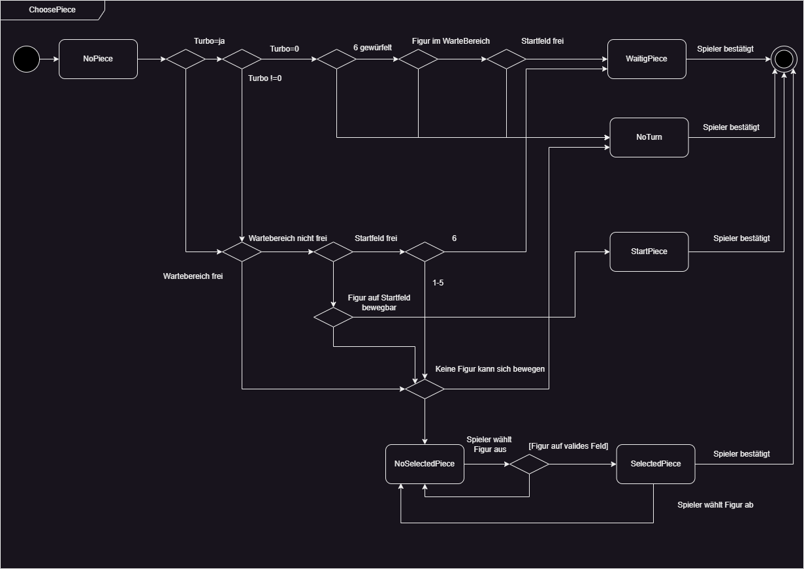
        

        
Play Power Card

          - 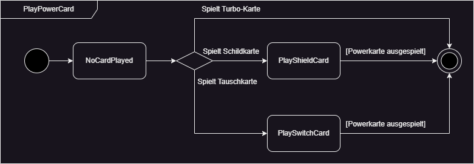

          - 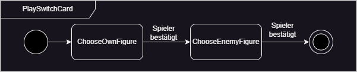
        

      

    
      

      
Choose Piece

    
      - 
      

    

  

  

  
Ceremony

  - 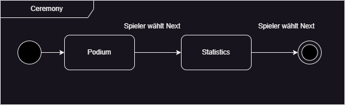
  

