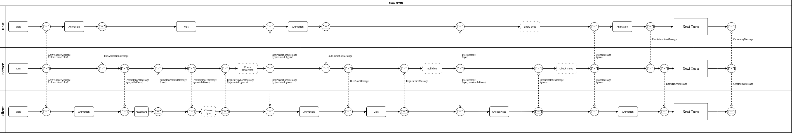
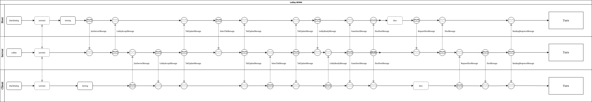

# Informationen zu dieser Seite

Auf dieser Seite finden Sie die BPMN Diagramme für das Projekt.

---

v0.3

Beschreibung

## Rollen und Aufgaben

- **Host**: Der Host verwaltet Animationen, signalisiert den Abschluss eines Zuges und den Übergang zur Siegerehrung.
- **Server**: Der Server verwaltet die Spiellogik, überprüft die Aktionen der Spieler, insbesondere die Powerkarten-Einsätze und die Zugvalidierung.
- **Client**: Der Client stellt die Spieleroberfläche dar und ermöglicht dem Spieler, Aktionen wie den Einsatz einer Powerkarte, das Würfeln und das Ziehen einer Figur auszuführen.

## Ablauf eines Spielzugs mit Powerkarte

### Spielzugaktivierung und Animation
- Der Spielzug beginnt mit einer "ActivatePlayerMessage", die vom Server an den Client gesendet wird. Diese Nachricht informiert den Spieler darüber, dass er an der Reihe ist.
- Der Client startet daraufhin eine Animation, um den Spieler visuell darauf hinzuweisen, dass sein Zug begonnen hat.

### Einsatz der Powerkarte
- Vor dem eigentlichen Würfeln hat der Spieler die Möglichkeit, eine Powerkarte einzusetzen. Der Client sendet dazu eine Anfrage an den Server, um eine Powerkarte zu aktivieren.
- Der Server überprüft die Verfügbarkeit und Gültigkeit der ausgewählten Powerkarte und bestätigt deren Einsatz mit einer entsprechenden Nachricht an den Client.
- Falls die Powerkarte erfolgreich aktiviert wird, könnte sie den kommenden Würfelwurf oder die Bewegungsregeln beeinflussen (je nach Spielmechanik der Powerkarte).

### Würfelwurf
- Nach dem Einsatz der Powerkarte fordert der Client einen Würfelwurf beim Server an, indem er eine "RequestDiceMessage" sendet.
- Der Server simuliert den Würfelwurf und schickt das Ergebnis als "DiceMessage" zurück an den Client. Das Würfelergebnis wird dabei dem Spieler auf dem Client-Interface angezeigt.
- Die Powerkarte könnte hier einen Einfluss auf das Würfelergebnis haben, falls diese Funktionalität vorgesehen ist.

### Spielfigur-Auswahl und Bewegung
- Basierend auf dem Würfelergebnis wählt der Spieler im Client eine Spielfigur, die bewegt werden soll. Diese Auswahl wird an den Server gesendet.
- Der Server validiert den geplanten Zug und überprüft, ob die Bewegung den Regeln entspricht, insbesondere unter Berücksichtigung der eingesetzten Powerkarte.
- Nach erfolgreicher Validierung sendet der Server eine "MoveMessage" an alle Clients, und die Bewegung der Spielfigur wird bei diesen durch eine Animation dargestellt.

### Zugabschluss und Übergang zum nächsten Zug
- Nach Abschluss der Bewegung sendet der Server eine "EndOfTurnMessage" an den Host und den Client, um den Abschluss des Spielzugs zu signalisieren.
- Der Host spielt eine Animation ab und steuert den Übergang zum nächsten Spielerzug mithilfe einer "Next Turn"-Funktion.

### Übergang zur Siegerehrung
- Falls das Spiel endet, sendet der Server eine "CeremonyMessage".
- Diese Nachricht leitet die Siegerehrung ein.

- Turn_BPMN_v0.3.2

Beschreibung

## Ablauf des Lobbyauswahl- und Spielstartprozesses

### Verbindungsaufbau und Lobbysuche
- Der Prozess startet mit der Anzeige eines Dialogs im Client und Host ("StartDialog"), in dem der Spieler nach einem passenden Spiel sucht.
- Der Client und der Host verbinden sich mit dem Server, dargestellt durch die "connect"-Schritte, um die Lobbyauswahl anzuzeigen.

### Beitritt zur Lobby
- Nach der Verbindungsherstellung geht der Prozess in den **Joining**-Schritt über, in dem der Host, Server und Client den Beitritt des Spielers zur Lobby koordinieren.
- Der Server sendet eine **JoinServerMessage** an den Host und den Client, die den Beitritt zur Lobby bestätigt.
- Anschließend erhält der Client vom Server eine **LobbyAcceptMessage**, die den erfolgreichen Beitritt zur Lobby signalisiert.

### Lobby-Status-Updates und Tischauswahl
- Der Server aktualisiert die Lobby-Informationen und sendet **TskUpdateMessages** an den Host und den Client, um den aktuellen Status der Lobby anzuzeigen.
- Der Client zeigt die verfügbaren Tsk`s an, und der Spieler kann einen Tisch auswählen, um daran teilzunehmen. Diese Auswahl wird durch die **SelectTskMessage** an den Server übermittelt.

### Start des Spiels
- Sobald die Tsk-Auswahl abgeschlossen ist und alle Spieler bereit sind (d.h eine entsprechende Nachricht gesendet haben), sendet der Server eine **GameStartMessage** an den Host und den Client, um das Spiel zu starten.
- Der Host und der Client empfangen diese Nachricht und bereiten den Übergang in das Spiel vor.

### Würfelwurf zur Bestimmung der Startreihenfolge
- Der Server fordert Client und Host per **DiceNowMessage** auf zu wuerfeln
- Zur Bestimmung der Spielerreihenfolge wird ein Würfelwurf durchgeführt. Der Host und Client fordern einen Würfelwurf vom Server an, indem sie eine **RequestDiceMessage** senden.
- Der Server führt den Würfelwurf durch und sendet das Ergebnis als **DiceMessage** an den Host und Client, die das Ergebnis anzeigen.

### Rangbestimmung und Übergang in das Spiel
- Basierend auf den Würfelergebnissen bestimmt der Server die Startreihenfolge und sendet eine **RankingResponseMessage** an den Host und den Client.
- Diese Nachricht gibt die endgültige Spielerreihenfolge an, und der Prozess wechselt in den Spielzustand, dargestellt durch den Übergang in den **Turn**-Prozess.

- Lobby_BPMN_v0.1.0

