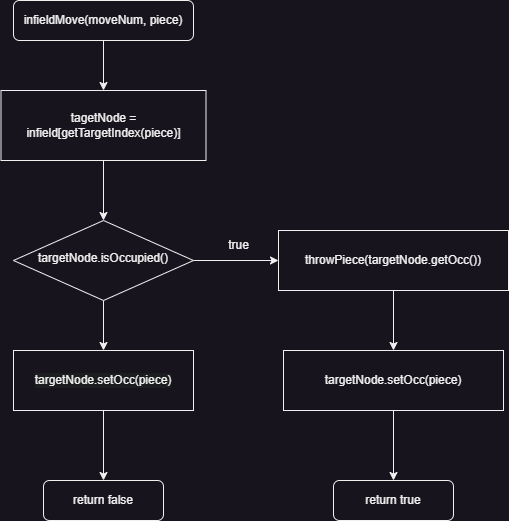

# Informationen zu dieser Seite

Auf dieser Seite finden Sie die Flussdiagramme für das Projekt.

---

v0.3

getHomeMoves v0.3.2

Dieses Flussdiagramm zeigt die Logik zur Bestimmung der "Heimzüge" einer Spielfigur auf einem Spielfeld.
Der Prozess beginnt mit dem Abrufen des aktuellen Indexes der Figur (figIndex) und der Farbe der Figur (col).
Basierend auf der Farbe wird der Startindex (startIndex) aus den Spielerdaten abgerufen.
Ein moveIndex wird berechnet, indem eine Zugnummer zu figIndex addiert wird.
Falls der moveIndex die Länge des Spielfeldes überschreitet, wird er mittels Modulo an den Anfang zurückgesetzt.
Verschiedene Bedingungen prüfen, ob der berechnete moveIndex innerhalb der gültigen Bereiche liegt, und geben entweder den angepassten moveIndex zurück oder 0, falls der Zug ungültig oder blockiert ist.

infieldMove v0.3.2

Dieses Flussdiagramm behandelt die Bewegung einer Figur innerhalb des Spielfeldes.
Zunächst wird der Zielknoten (Position) für einen bestimmten Zug berechnet und geprüft, ob dieser besetzt ist.
Falls der Zielknoten besetzt ist, wird eine Aktion (throwPiece) ausgelöst, um die besetzte Position zu handhaben, wodurch die Figur diesen Platz einnehmen kann.
Falls der Zielknoten unbesetzt ist, wird die neue Figur dort platziert, und das Diagramm gibt entweder false zurück, falls keine weitere Aktion notwendig ist, oder true, falls eine Figur geworfen wurde.

move v0.3.2

Dieses Flussdiagramm stellt die Hauptbewegungsfunktion dar und enthält Prüfungen sowie Aufrufe zu anderen Bewegungsfunktionen.
Der Prozess startet mit der move()-Funktion, die zunächst prüft, ob ein Zug möglich ist, indem sie tryMove() aufruft.
Falls tryMove() fehlschlägt, wird ein Fehler zurückgegeben.
Falls der Zug möglich ist, wird geprüft, ob "Heimzüge" vorhanden sind. Wenn ja, wird homeMove() aufgerufen.
Wenn keine Heimzüge verfügbar sind, wird infieldMove() ausgeführt.

