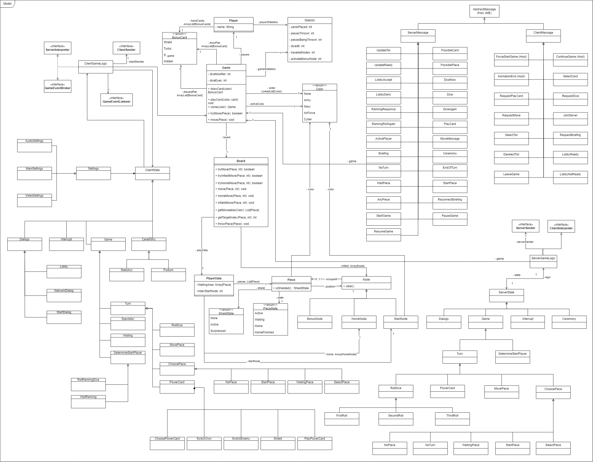

# Informationen zu dieser Seite

Auf dieser Seite finden Sie die Klassendiagramme für das Projekt.

---

Es gibt zusätzlich auch noch eine [Erläuterung](Klassendiagramme/Erläuterungen_Klassendiagrammen_v0.3.1.pdf) für diese Diagramme.

---

Klassendiagramme v0.3

- Model Gesamt

  

Model

- Model Game

- Model Server

- Model Client

- View

Klassendiagramme v0.4

- model v.0.4

Klassendiagramme v0.5

- client_v0.5
  

- model_client_v0.5
  

- model_game_v0.5
  

- model_v0.5
  

- model_server_v0.5
  

