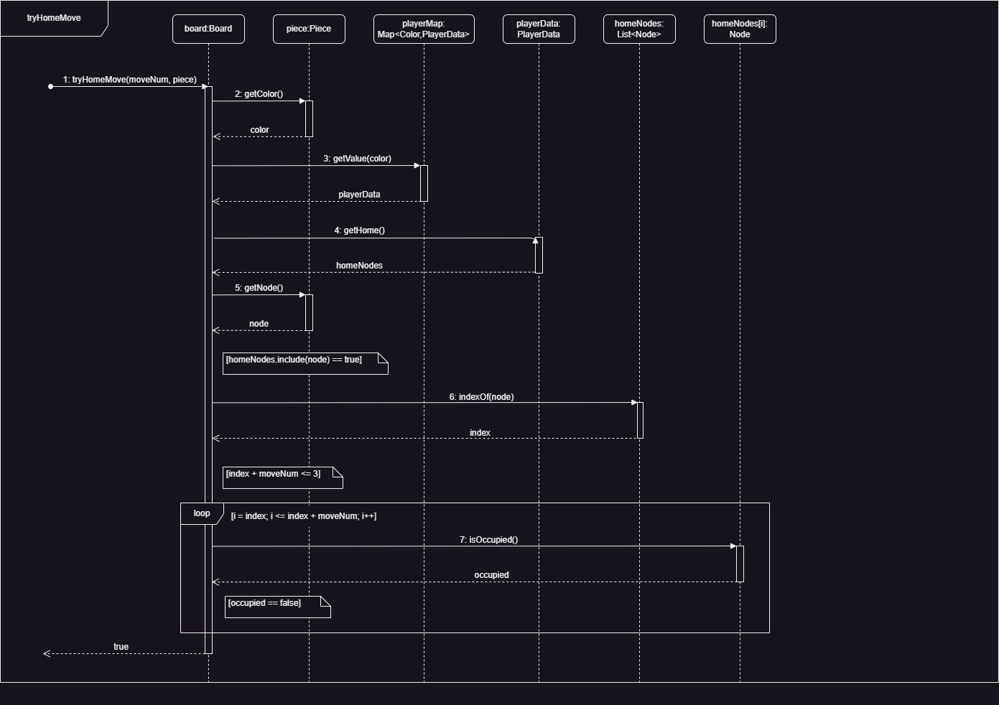
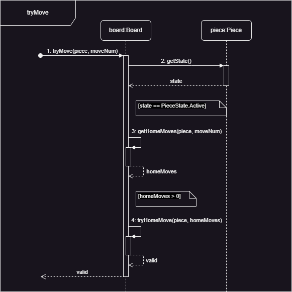
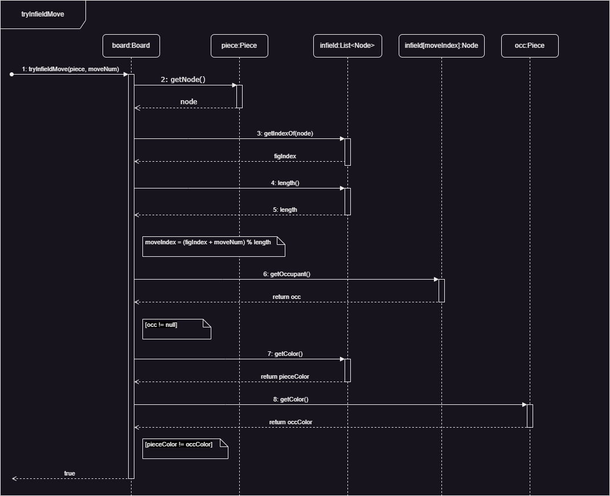
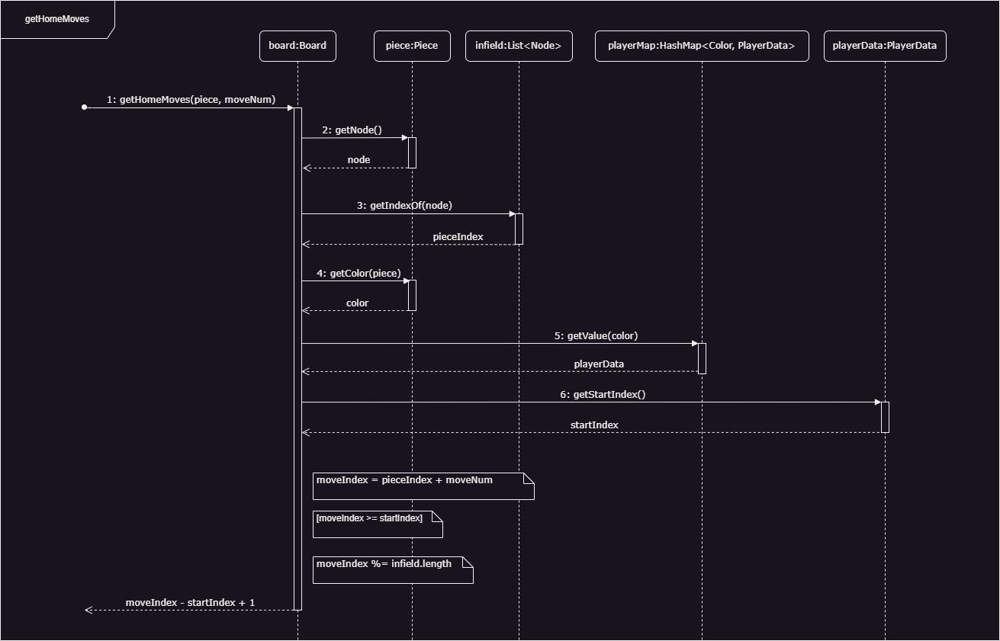

# Informationen zu dieser Seite

Auf dieser Seite finden Sie die Sequenzdiagramme für das Projekt.

---

v0.3

tryHomeMove

  Das Sequenzdiagramm beschreibt die Methode tryHomeMove, die prüft, ob ein Zug eines Piece in die HomeArea eines Spielers möglich ist. Zunächst wird die Farbe des Piece abgerufen und basierend darauf der zugehörige PlayerData. Daraus wird die Liste der homeNodes sowie das aktuelle Feld der Figur bestimmt.
  Liegt das aktuelle Feld der Figur in der HomeArea, wird der Index des Felds ermittelt und geprüft, ob das Ziel des Zuges innerhalb des Bereichs bleibt. Danach wird für jedes Feld im geplanten Zugbereich überprüft, ob es frei ist. Sind alle Felder unbesetzt, gibt die Methode true zurück und der Zug ist möglich.

- tryHomeMove_v0.3.2
  

TryMove

Das Sequenzdiagramm für die Methode tryMove beschreibt die Prüfung, ob ein Piece um eine bestimmte Anzahl an Feldern bewegt werden kann, abhängig vom aktuellen Status und der Position des Piece.
Die Methode beginnt, indem sie den Zustand (state) des Piece überprüft. Wenn dies im Active State ist, wird die Anzahl der möglichen Bewegungen im Heimfeldbereich (homeMoves) berechnet, indem getHomeMoves aufgerufen wird. Wenn homeMoves größer als null ist, also ein Teil des Zuges in den Heimfeldbereich reicht, wird tryHomeMove mit homeMoves aufgerufen, um zu prüfen, ob der Zug erfolgreich durchgeführt werden kann. Die Methode gibt das Ergebnis dieser Prüfung zurück.

- TryMove v0.3.2
  

TryInfieldMove

Das Sequenzdiagramm für die Methode tryInfieldMove beschreibt den Ablauf zur Prüfung, ob ein Piece im Spielfeldbereich erfolgreich bewegt werden kann.
Zuerst wird der aktuelle Index des Spielfelds (figIndex) ermittelt, auf dem sich das Piece befindet, sowie die Gesamtlänge des Spielfelds (length). Der Ziel-Index (moveIndex) wird dann berechnet, indem die Bewegungszahl (moveNum) zum aktuellen Index addiert und das Ergebnis mit der Spielfeldlänge modulo gerechnet wird, sodass der Ziel-Index im Spielfeldbereich bleibt.
Im nächsten Schritt wird überprüft, ob das Zielfeld belegt ist. Ist dies der Fall und gehört die besetzende Spielfigur nicht zur gleichen Farbe (also zum gleichen Spieler), gibt die Methode true zurück, was anzeigt, dass der Zug erfolgreich ausgeführt werden kann.

- TryInfieldMove v0.3.2
  

getHomeMoves

Das Sequenzdiagramm für die Methode getHomeMoves zeigt, wie die Anzahl der Bewegungen eines Piece in der HomeArea berechnet wird. Zuerst wird der aktuelle Index (pieceIndex) des Piece im Spielfeld ermittelt. Danach wird der startIndex in den HomeNodes des Spielers abgerufen. Anschließend wird der Ziel-Index (moveIndex) durch Addition der geplanten Schritte (moveNum) zum aktuellen Index berechnet. Wenn dieser Ziel-Index die HomeArea erreicht oder überschreitet, wird der Index auf die Spielfeldlänge angepasst. Die Methode gibt schließlich die Anzahl der Schritte in der HomeArea zurück, indem die Differenz zwischen moveIndex und startIndex berechnet wird.

- getHomeMoves_v0.3.2
  

