# Informationen zu dieser Seite

Auf dieser Seite findet man die Zustandsdiagramme das Spiel.

---

Es gibt zusätzlich auch noch eine [Erläuterung](Zustandsdiagramme/Erläuterungen_Zustandsdiagrammen_v0.3.1.pdf) für diese Diagramme.

---

# Artefakte

v0.3

Server

- Server_State_v0.3.1
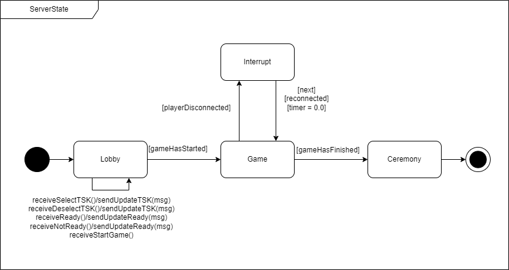

- Server_Game_v0.3.1
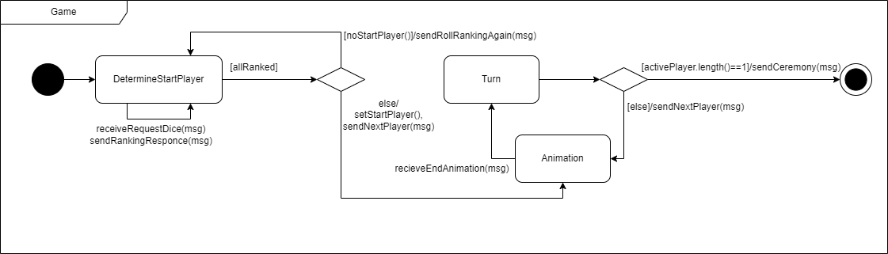

- Server_Turn_v0.2.1
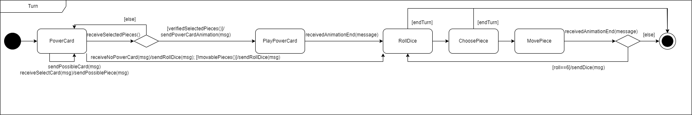

- Server_RollDice_v0.3.1
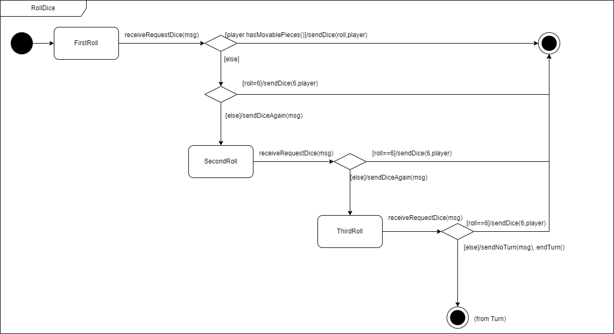

- Server_ChoosePiece_v0.3.1
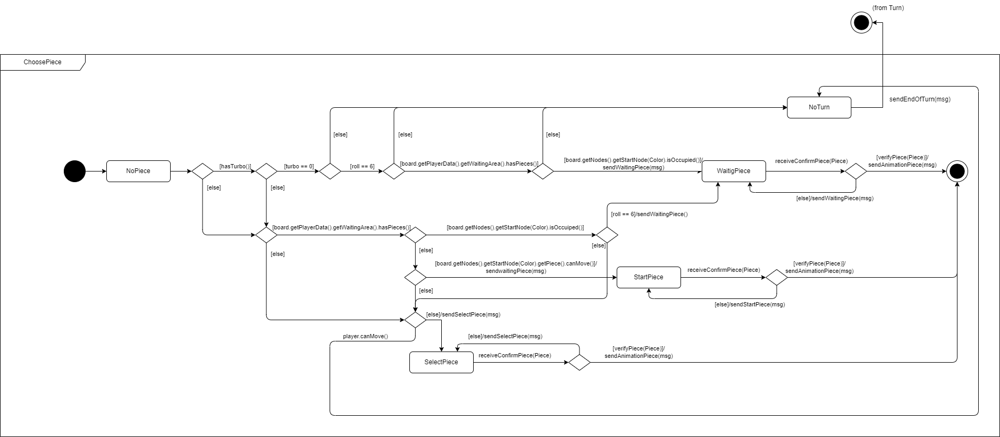

  
Client

- Client_State_v0.3.1
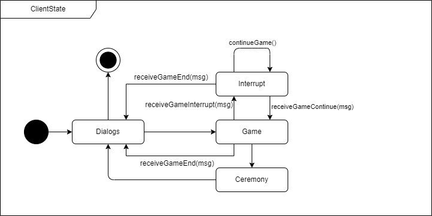

- Client_Game_v0.2.1
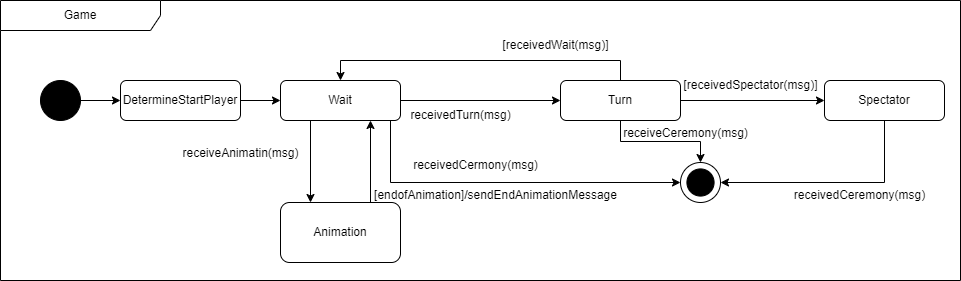

- Client_DetermineStartPlayer_v0.2.1
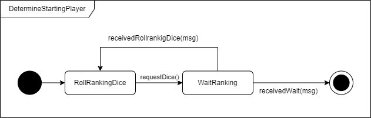

- Client_ChoosePiece_v0.2.3
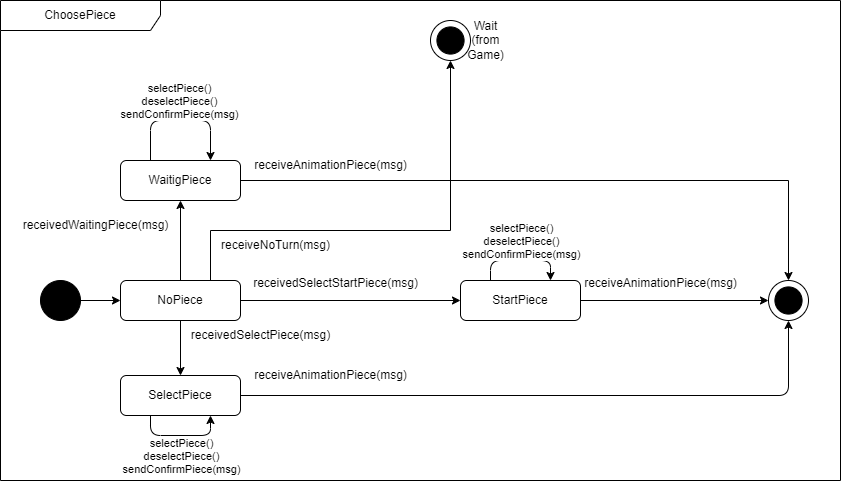

- Client_PowerCard_v0.2.3
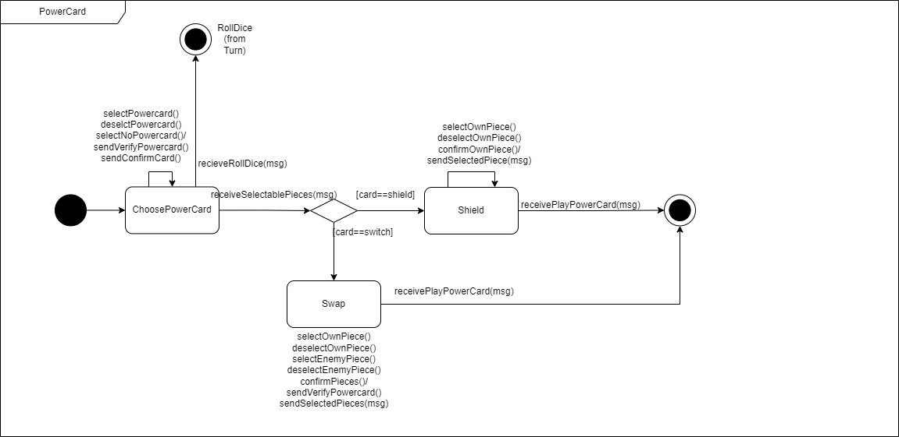

- Client_Turn_v0.2.3
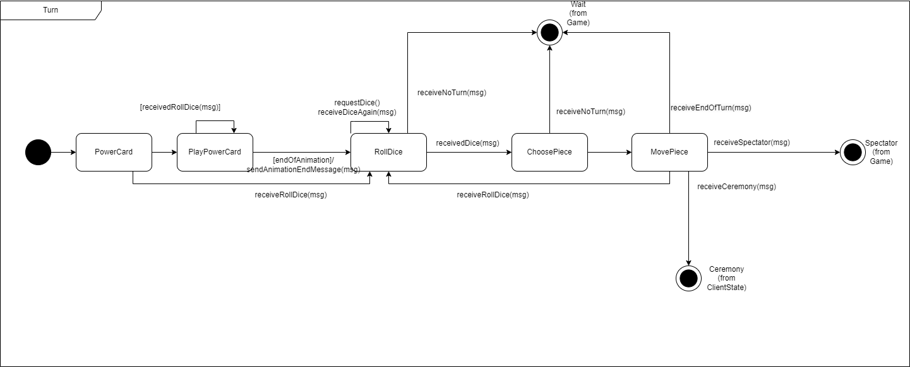 

- Client_Settings_v0.3.1
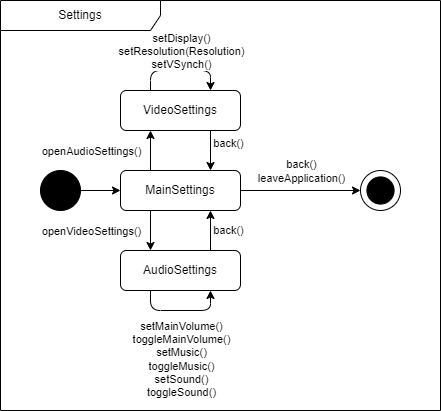

  

    
Dialogs

- Client_Dialogs_v0.3.1
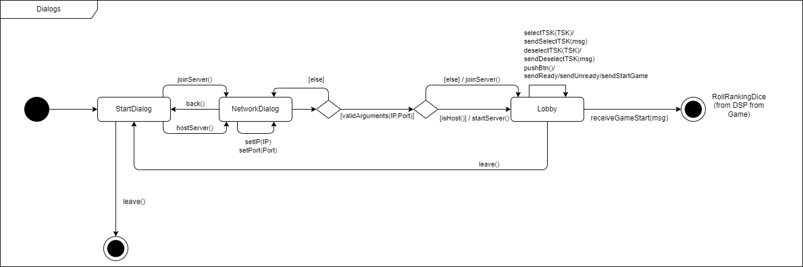

  

    
Ceremony

- Client_Ceremony_v0.2.1
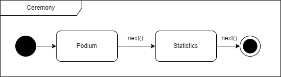
  
  

