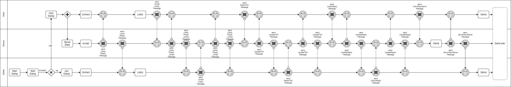
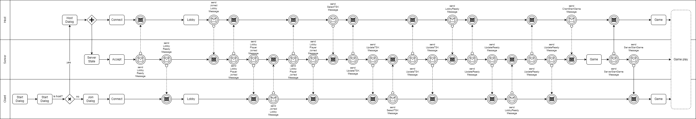
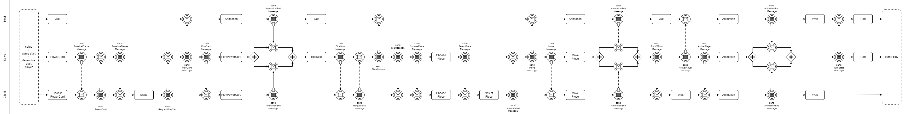
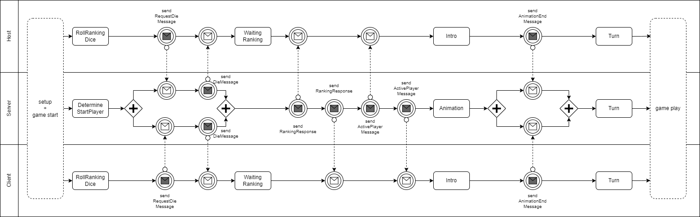

# Informationen zu dieser Seite

Auf dieser Seite finden Sie die BPMN Diagramme für das Projekt.

---

v0.5

### Allgemeines Diagramm v0.5

Beschreibung
 

Dieses Diagramm zeigt den allgemeinen Ablauf eines Spiels von der Lobby bis zum Gameplay:

- Es integriert verschiedene Prozesse wie die Verbindung von Spielern, den Start des Spiels und das eigentliche Gameplay.
- Es beschreibt die Kommunikation zwischen den Akteuren (Host, Server, Client) sowie die Synchronisation von Aktionen und Nachrichten.

---

### Lobby Diagramm v0.5

Beschreibung
 

Dieses Diagramm zeigt den Prozess für die Verbindung von Spielern in einer Lobby vor dem Start eines Spiels. Es wird zwischen Host, Server und Client unterschieden:

- Host: Erstellt die Lobby und wartet auf Verbindungen.
- Client: Schließt sich der Lobby an, basierend auf einer Entscheidung (z. B. "Bin ich der Host?").
- Server: Verarbeitet Verbindungsanfragen und synchronisiert die Teilnehmer.

---

### Gameplay Diagramm v0.5

Beschreibung
 

Das Gameplay-Diagramm beschreibt den eigentlichen Ablauf des Spiels, wobei es Prozesse zwischen Host, Server und Client koordiniert:

- Server: Zentrale Einheit, die Nachrichten wie Animationen oder Spielerwechsel steuert.
- Client: Nimmt Eingaben vor (z. B. Würfeln, Karten auswählen) und kommuniziert mit dem Server.

---

### DSP Diagramm v0.5

Beschreibung
 

Dieses Diagramm stellt eine Entscheidungsfindung dar, die in das Gameplay eingebunden ist.

- Server: Entscheidet, wer starten darf oder welche Aktionen ausgeführt werden können.
- Client: Trifft Entscheidungen (z. B. Power-Karten auswählen) und sendet die Ergebnisse zurück.

