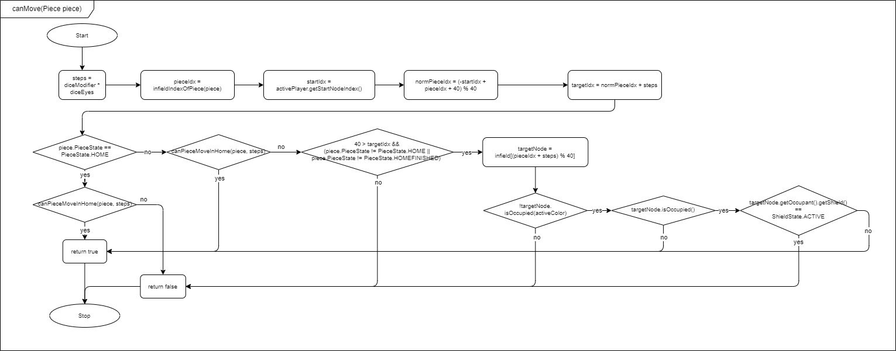

# Informationen zu dieser Seite

Auf dieser Seite finden Sie die Flussdiagramme für das Projekt.

---

Flussdiagramme v0.5
 

Beschreibung getHomeMoves_v0.5.0
 

getHomeMoves(Piece piece, int steps)

- Dieses Diagramm zeigt die Logik einer Funktion, die berechnet, wie viele Schritte ein Spielstein im Spielfeld zurücklegen kann, bevor er in sein Zielfeld (z. B. "Home") gelangt.

  Hauptschritte:

  Start der Berechnung:

- Die aktuelle Position (pieceIndex) des Spielsteins wird aus dem Spielfeld abgerufen.
- Die Farbe des Spielsteins wird ermittelt, um seinen Startpunkt (startIndex) im Spielfeld zu definieren.

  Bewegungsindex berechnen:

- Der potenzielle neue Index (moveIndex) wird durch Addition der aktuellen Position (pieceIndex) und der Bewegungsanzahl (steps) berechnet.

  Prüfung auf Spielfeldlänge:

- Wenn der Bewegungsindex die Spielfeldlänge überschreitet, wird der Index modulo der Spielfeldlänge berechnet (Rückkehr an den Startpunkt).

  Prüfung auf Zielfeld:

- Das Diagramm überprüft, ob der neue Bewegungsindex über den Startpunkt hinausgeht, was darauf hindeutet, dass der Stein in das "Home"-Feld eintreten kann.
- Es gibt eine Rückgabe basierend darauf, wie viele Schritte übrig bleiben oder wie weit der Spielstein in das Home-Feld bewegt werden kann.

  Ergebnis: Die Funktion gibt entweder die verbleibenden Schritte bis zum "Home" oder 0 zurück, wenn der Zug nicht möglich ist.

---

Beschreibung infieldMove_v0.5.0

infieldMove(int moveNum, Piece piece)

- Dieses Diagramm beschreibt die Logik, wie ein Spielstein innerhalb des Spielfelds bewegt wird, und prüft, ob das Ziel besetzt ist.

  Hauptschritte:

  Start der Bewegung:

- Der Zielknoten (targetNode) wird basierend auf der aktuellen Position des Spielsteins und der Anzahl der Schritte (moveNum) berechnet.

  Prüfung, ob das Ziel besetzt ist:

- Wenn das Zielknotenfeld unbesetzt ist, wird der Spielstein dorthin bewegt, und die Funktion gibt false zurück (keine Kollision).
- Wenn das Ziel besetzt ist, wird die Kollision verarbeitet:
- Die Funktion "wirft" das vorhandene Objekt (z. B. entfernt es oder schickt es zurück zur Basis).
- Der Spielstein wird auf das Feld gesetzt, und die Funktion gibt true zurück, um anzuzeigen, dass eine Kollision aufgetreten ist.

  Ergebnis: Die Funktion stellt sicher, dass Spielzüge gültig sind und Konflikte auf dem Spielfeld korrekt behandelt werden.

Flussdiagramme v0.6
 

