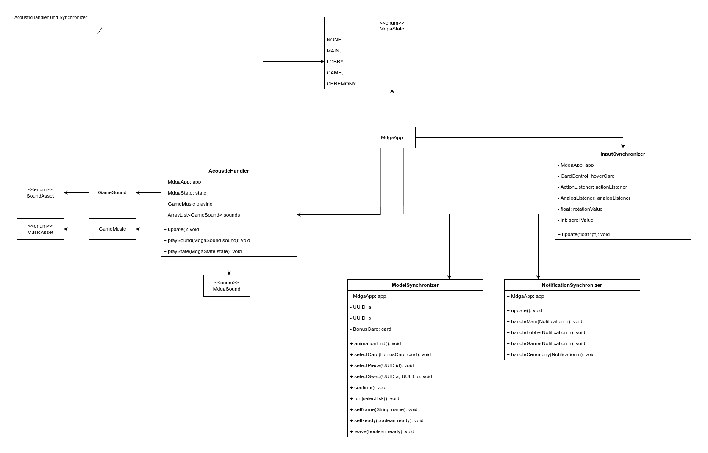

# Informationen zu dieser Seite

Auf dieser Seite finden Sie die Klassendiagramme die im Rahmen der Implementierungsphase für das Projekt erstellt wurden.

---

Es gibt zusätzlich auch noch eine [Erläuterung](./Klassendiagramme/Erläuterungen_Klassendiagrammen_v0.3.1.pdf) für diese Diagramme.

---

v.0.6
 

- Klassendiagramm v.0.6

- Notification v.0.6

- model server v0.6.2

- model client v0.6.2

View
 

- Button v0.6

- Dialog v0.6

- AcousticHandleundSynchronizer v0.6

- MdgaAppUndView v0.6

- board v0.6

- gui v0.6

- hierachi view v0.6

- outline v0.6

