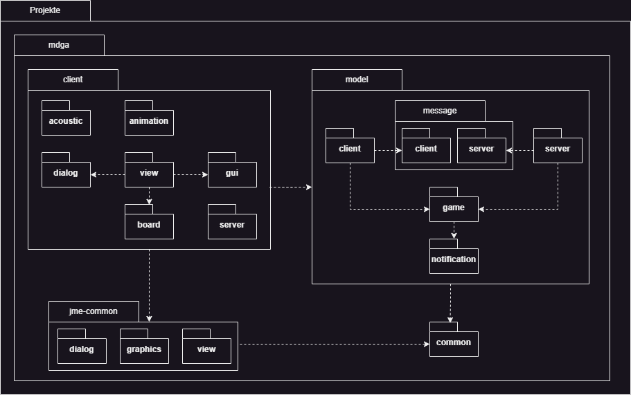

# Informationen zu dieser Seite

Auf dieser Seite finden Sie die Paketdiagramme für das Projekt.

---

# Projektstruktur v0.5.0

Beschreibung
 

## mdga
### client
- **acoustic**
- **animation**
- **dialog**
- **view**
      - **board**
- **gui**
- **server**

### model
#### message
- **client**
- **server**
- **game**
      - **notification**

## jme-common
- **dialog**
- **graphics**
- **view**

### Verbindungen
- `client.dialog` <-> `client.view`
- `client.view` -> `client.board`
- `client` -> `model`
- `model.message.client` <-> `model.message.server`
- `model.message` -> `game`
- `game` -> `notification`
- `client` -> `jme-common`
- `model` -> `jme-common.common`

