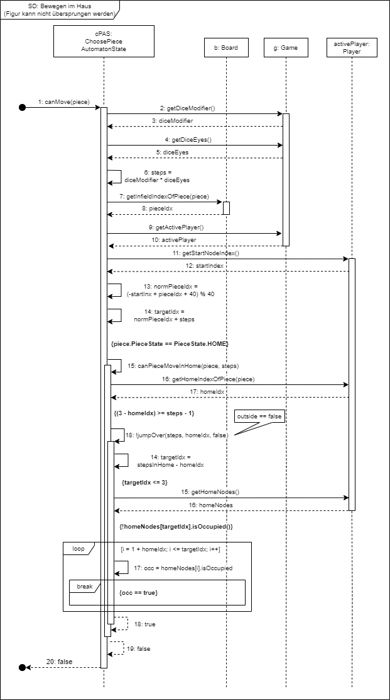

# Informationen zu dieser Seite

Auf dieser Seite finden Sie die Sequenzdiagramme für das Projekt.

---

v.0.5
 

- Bewegung_ins_Haus_(normal)
_v0.5.png)

- Bewegen_im_Haus_v0.5

- Bewegen_im_Haus_(keine_Figur)_v0.5
_v0.5.png)

- Bewegen_im_infield_(normal)_v0.5
_v0.5.png)

- Bewegen_im_infield_(Figur_mit_Schild)
_v0.5.png)

