# Informationen zu dieser Seite

Auf dieser Seite findet man die Zustandsdiagramme das Spiel.

---

v0.4

Server

- Server State v0.4.1
  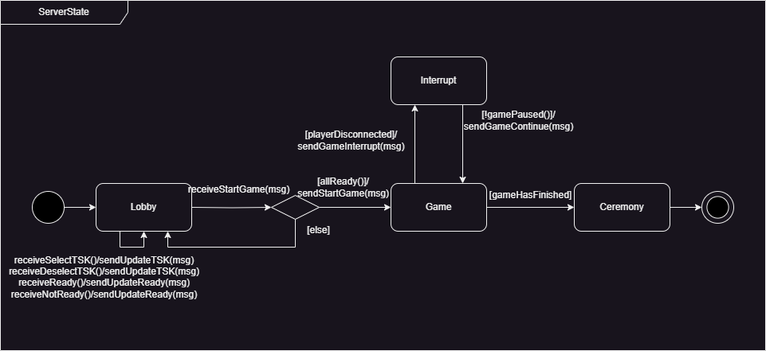

- Game v0.4.1
  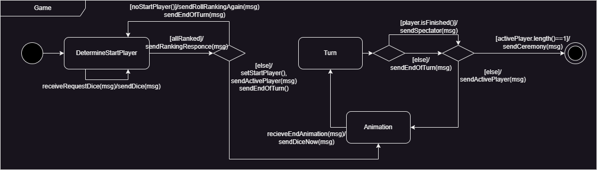

- Server Turn v0.4.1
  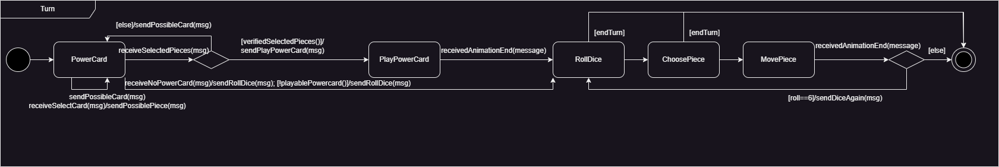

- RollDice v0.4.1
  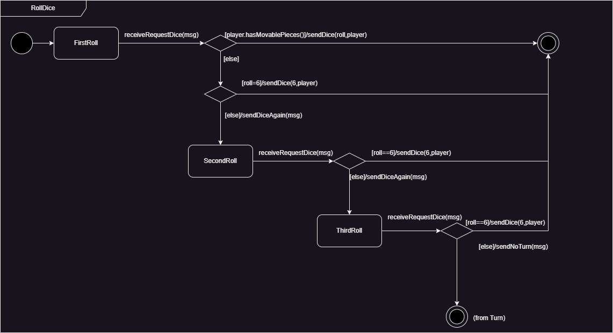

- Server Choose Piece v0.4.1
  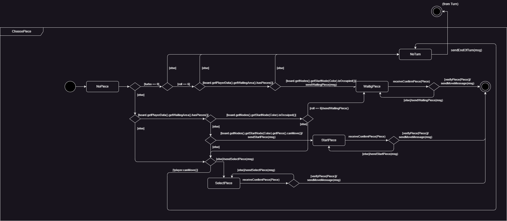

  
Client

- ClientState v0.4.1
  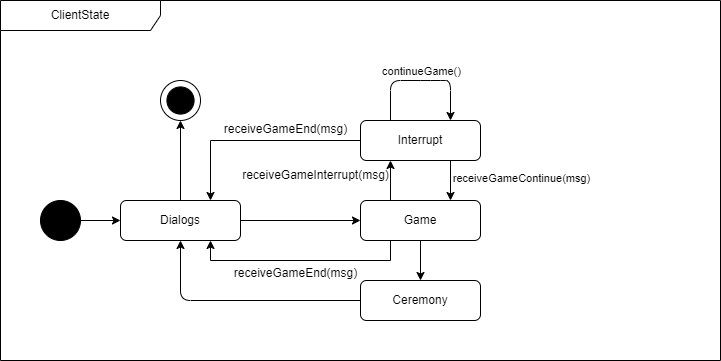

- Game v0.4.1
  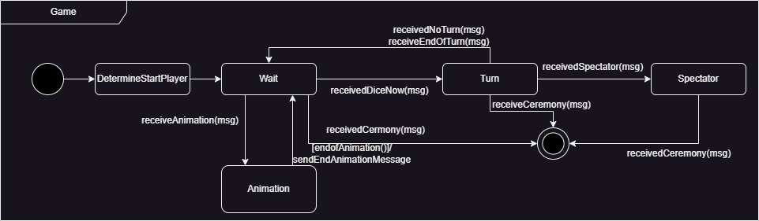

- DetermineStartingPlayer v0.4.1
  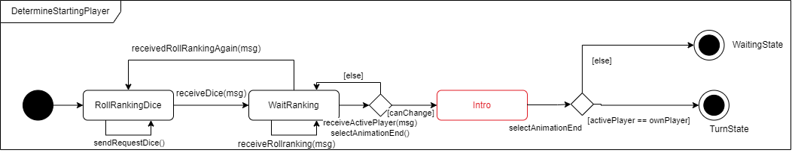

- Client Choose Piece v0.4.1
  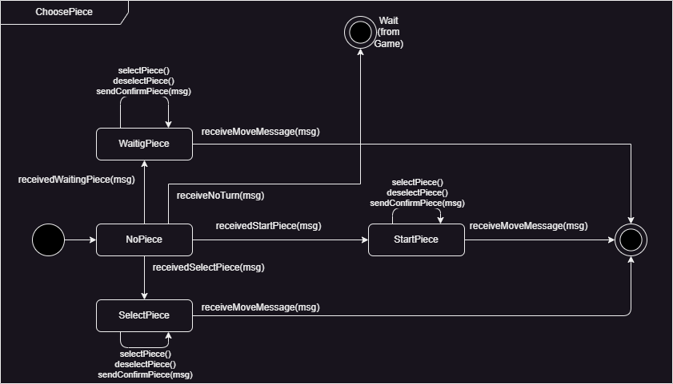

- Client Power Card v0.4.1
  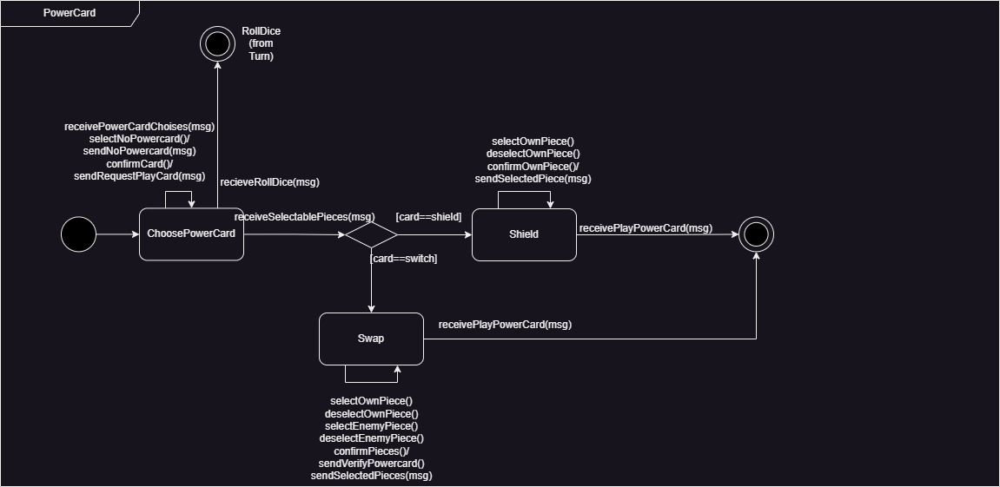

- Client Turn v0.4.1
  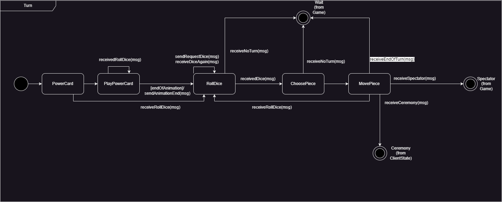

- Settings v0.3.1 (unverändert)
  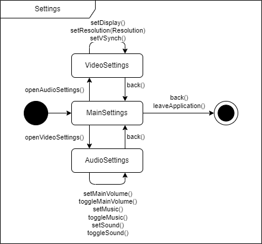

  
- Dialogs v0.4.1
  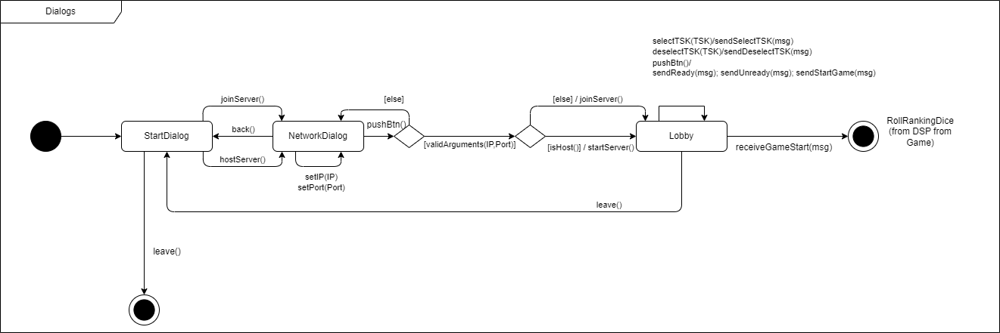

- Ceremony v0.2.1 (unverändert)
  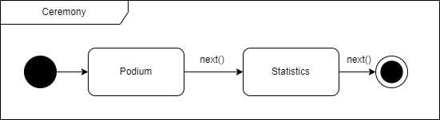

